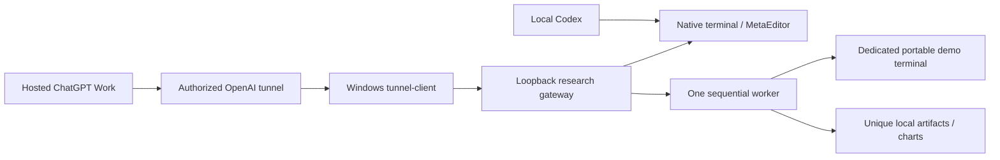

# Trust and lifecycle

Local source/presets and generated outputs live beneath one research workspace. Path resolution rejects traversal, escape through symlinks and alternate streams. Native URLs must be loopback HTTP(S), contain no URL credentials/query/fragment, and obtain bearer headers only from local bindings. Empty native policies allow nothing. Both actual schema and the reviewed fixed arguments must match; tool names/categories come from the checked official catalogue and cannot be re-labelled to enable account trading/shell. Compile/source reads require explicit scoped argument mapping.

A website list is not an installed schema. No arbitrary native operation is enabled by default. Full native export/start/config mutation adapters are intentionally unavailable until actual parameter and response shapes can be validated on Windows; the gateway reports missing capabilities, and bounded Python/CLI fallback jobs cover those operations. Direct local native usage, if sufficient, avoids gateway overhead and must use its own reviewed `enabled_tools` list. Source mutation can be performed by local Codex in the research checkout; hosted gateway arbitrary editing is deliberately not exposed.

The gateway can generate charts on Linux, but `--mock` labels its health and cannot compile, test or contact the broker. On Windows, worker broker connections require demo trade mode. Historical EA orders in Strategy Tester are simulation; no endpoint places/modifies/closes account orders, including demo-account orders. The original strategy is neither implemented nor optimized here. Supplied EAs must be trusted: this is not an OS sandbox against hostile EA/native code. DLL/account trading and remote/cloud agents are disabled in generated tester configs.

Fallback jobs share a one-thread queue. Queued cancellation prevents execution; running jobs see a cancellation event. MT5 process deadlines are bounded and the worker terminates only its launched process tree. Pre-existing dedicated terminal/editor sessions are detected by exact executable path and left alone. Operator must close them before fallback use. The gateway does not stop another terminal installation. Native read requests do not launch tester jobs.

Up to 100 job entries are retained per gateway process; restarting clears status but not artifacts. Stop gateway only after cancelling/polling active jobs; its executor waits for work during normal shutdown. Native HTTP reads are network bounded; chart jobs have bounded input rather than OS-level hard isolation. Cancellation is cooperative between stages, so plotting already underway can complete before cancellation becomes visible. A job completion means the function completed; a smoke manifest remains INCONCLUSIVE until evidence is reviewed.

A unique smoke directory includes a settings manifest and per-asset INIs, report/image files, fresh scoped logs and locally implemented EA CSV/JSON audits, data/specification/quality files and charts when data is available. Freshness/run identifiers distinguish reports from older runs. Date-level journal files can contain earlier lines: freshness alone is not EA attribution, so manually or through an EA-specific adapter isolate the relevant interval/run. Common Files and other installation directories are not swept. Tester report settings/deals and actual audit identity must be independently checked. Partial failures retain evidence and warnings.

Cloud installation changes only this repository and its own dependency environment. Runtime account bindings are Windows-local; no cloud secret declaration implies Windows connectivity. Environment draft saving does not publish a snapshot; Nicolas must review/save/publish through environment settings.
